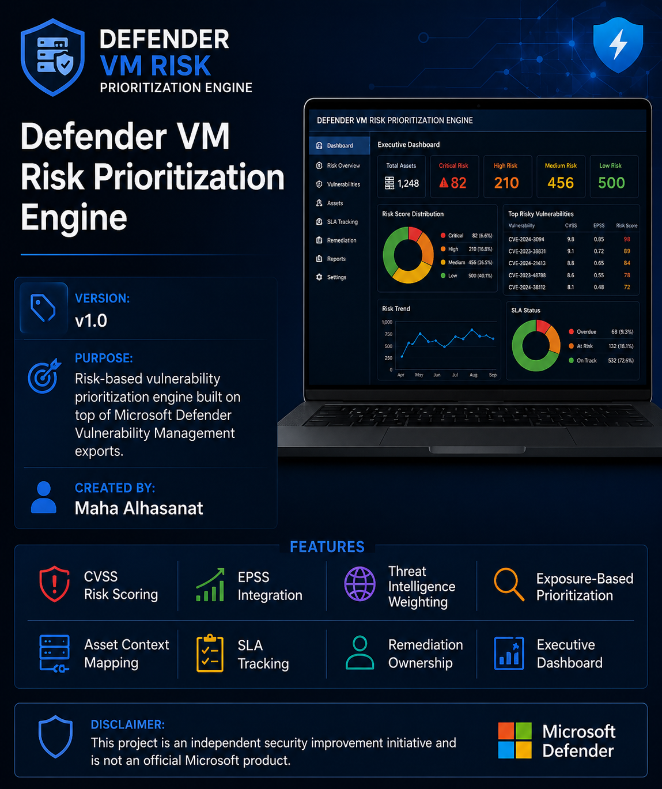
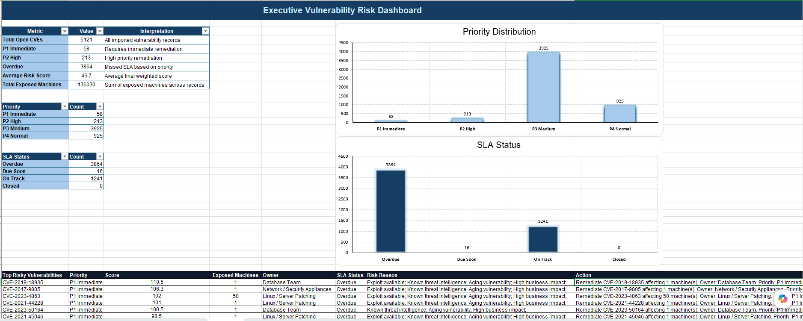
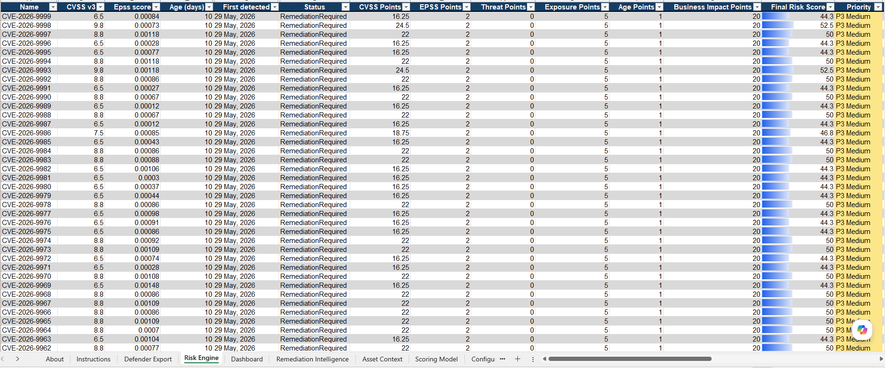
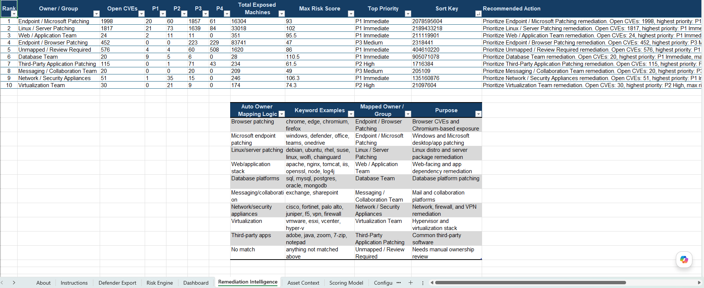

<p align="center">
  
</p>
# Defender VM Risk Prioritization Engine


## Overview

Defender VM Risk Prioritization Engine is an Excel-based security improvement initiative designed to enhance vulnerability management operations by adding a risk-based prioritization layer on top of Microsoft Defender Vulnerability Management exports.

The goal is not to replace Microsoft Defender Vulnerability Management, but to help security teams prioritize remediation activities based on real operational risk.

---
## Download

The latest version of the engine is available here:

📥 **Engine:**  
[Defender_VM_Risk_Prioritization_Engine_v1.0](Engine/Defender_VM_Risk_Prioritization_Engine_v1.0.xlsx)

---
---

## Sample Dataset

A sanitized Defender Vulnerability Management sample export is included for testing and demonstration purposes.

The dataset contains multiple vulnerability scenarios covering:

- Critical, High, Medium, and Low severity findings
- Different CVSS score ranges
- Different EPSS exploitation probabilities
- Exploit availability scenarios
- Known threat indicators
- Security alert correlation
- Different exposure levels
- Vulnerability age variations
- Multiple remediation statuses

The sample data is designed to demonstrate how the engine converts vulnerability information into risk-based priorities (P1–P4).

📄 **Sample Export:**  
[Sample Defender VM Export](Sample-Data/Sample_Defender_VM_Export.csv)

---

## Problem Statement

Modern vulnerability management programs can generate thousands of findings.

While vulnerability scanners provide visibility, security teams still need to answer:

- Which vulnerabilities should be remediated first?
- Why is this vulnerability considered high priority?
- Who should own the remediation?
- Which actions provide the highest risk reduction?

This engine helps convert vulnerability data into actionable remediation decisions.

---
## Supported Input

Designed to work with Microsoft Defender Vulnerability Management exports containing fields such as:

- CVE / Vulnerability Name
- Severity
- CVSS Score
- EPSS Score
- Exploit Availability
- Known Threat Indicators
- Security Alerts
- Exposed Machines
- Detection Dates
- Software Information

---

## Key Features

✔ CVSS Risk Scoring  
✔ EPSS Exploitation Probability Integration  
✔ Exploit Availability Weighting  
✔ Threat Intelligence Context  
✔ Security Alert Correlation  
✔ Exposure-Based Prioritization  
✔ Vulnerability Age Factor  
✔ Business Impact Mapping  
✔ Automatic Owner Assignment  
✔ SLA Tracking  
✔ Executive Dashboard  
✔ Remediation Intelligence View  

---

## Risk Scoring Methodology

The engine calculates risk using multiple weighted factors:

```
Final Risk Score =
CVSS Impact
+ EPSS Probability
+ Threat Intelligence
+ Exposure Impact
+ Vulnerability Age
+ Business Context
```

Risk is then converted into operational priorities:

| Priority | Description |
|---|---|
| P1 | Critical remediation priority |
| P2 | High remediation priority |
| P3 | Planned remediation |
| P4 | Low risk / standard lifecycle |

---

## Engine Workflow

### 1. Import Defender VM Export

Import vulnerability data exported from Microsoft Defender Vulnerability Management.

---

### 2. Risk Calculation Engine

Automatically calculates:

- CVSS Points
- EPSS Points
- Threat Weight
- Exposure Score
- Age Score
- Business Impact Score

The combined score determines the final risk priority.

---

### 3. Asset Context Mapping

Adds business awareness using:

- Asset criticality
- Exposure type
- Software ownership
- Responsible remediation team

---

### 4. Remediation Intelligence

Provides:

- Ownership summary
- High-risk vulnerability grouping
- SLA visibility
- Recommended remediation focus

---

## Screenshots

### Executive Dashboard



---

### Risk Engine



---

### Remediation Intelligence



---

## Repository Structure

```
Defender-VM-Risk-Prioritization-Engine

├── Engine
│   └── Defender VM Risk Engine.xlsx
│
├── Documentation
│
├── Screenshots
│
└── Sample-Data
```

---

## Version

Current Release:

**v1.0**

Initial release includes:

- Risk calculation engine
- Priority classification
- SLA tracking
- Asset context mapping
- Executive reporting dashboard

---
## Future Enhancements

Planned improvements:

- Additional risk tuning options
- Extended asset classification
- More remediation analytics
- Automation opportunities

---

## Disclaimer

This project is an independent security improvement initiative.

It is not an official Microsoft product and is not affiliated with Microsoft.

Scoring models and SLA definitions should be reviewed and adjusted based on each organization's vulnerability management policy.

---

## Author

Created by:

**Maha Alhasanat**

Cybersecurity | SOC Operations | Vulnerability Management | Threat Detection
